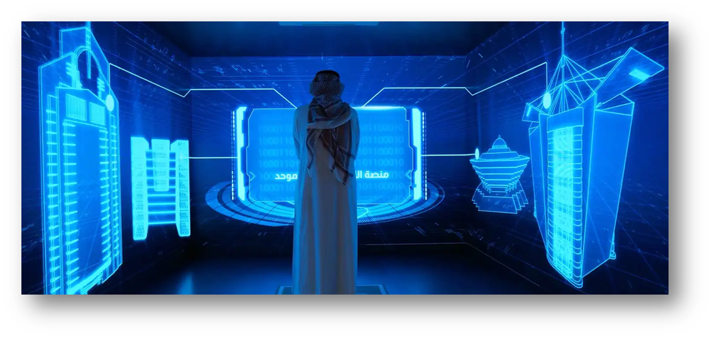

# About Dubai:A leading innovation cradle

Dubai is a leading innovation cradle. It's where cutting edge R\&D taps into global expertise to launch and test next-generation businesses, products and services. Dubai is a prime destination for companies conducting research and development (R\&D) across a range of emerging sectors, including artificial intelligence (AI), robotics, blockchain technology, fintech, autonomous transport, biotechnology and clean energy. Building on its forward-thinking leadership, agile financial and regulatory ecosystem, Dubai has emerged as a trusted investment partner both for established large scale organizations and the SME sector, guaranteeing legal security and strong governance.

