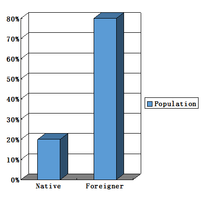
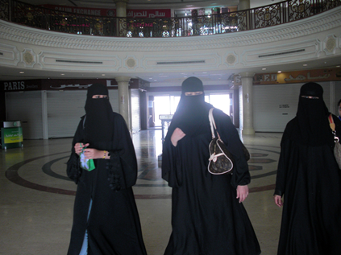

# About Dubai:Culture

Culture in Dubai is rooted in Islamic.However, the UAE is tolerant and welcoming to foreigners who do not practice the religion of Islam. Women don't face discrimination. Courtesy and hospitality are one of the many virtues of Dubai. Rulers are keen to maintain their culture and do so through a number of practices.

 

The official language of the country is Arabic, however most people in and out of the workplace communicate in English. There are so many different nationalities in Dubai, English finds common ground with most people. The majority of road and shop signs, restaurant menus etc. are in both English and Arabic. Dubai is a cosmopolitan city and visitors can dress however they like. Still, a good amount of respect for local customs is appreciated
