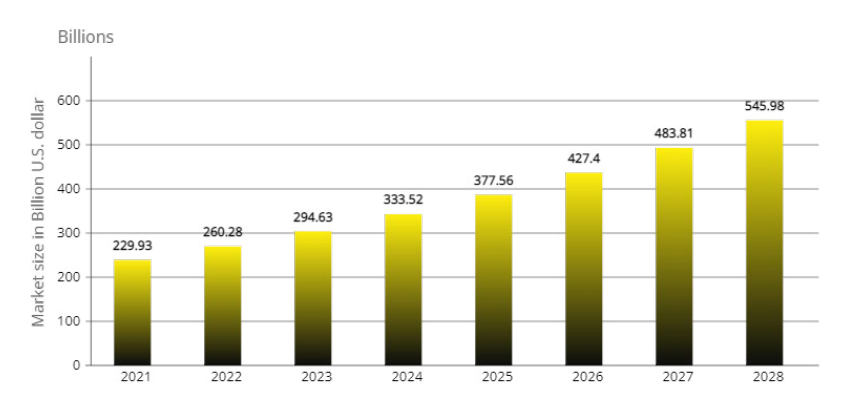

# Market challenges

According to Globe News Wire, the worldwide gaming market is predicted to increase at a compound annual growth rate (CAGR) of 13.20 % from $ 229.93 billion in 2021 to $ 260.28 billion in 2022. High-speed internet connections are becoming more common, particularly in emerging nations, connections are becoming more common, particularly in emerging nations, making online gaming more accessible in recent years. As a result, such developing economies and comfort are expected to acquire traction. The market is expected to reach $ 545.98 billion in 2028 at a CAGR of 13.20% .

Gaming has become more prevalent in recent years. Most people find online games attractive and a modest way to find free time from their hectic schedules. And with the increasing usage of smartphones and consoles and cloud penetration, the market shows high potential growth in the future.
